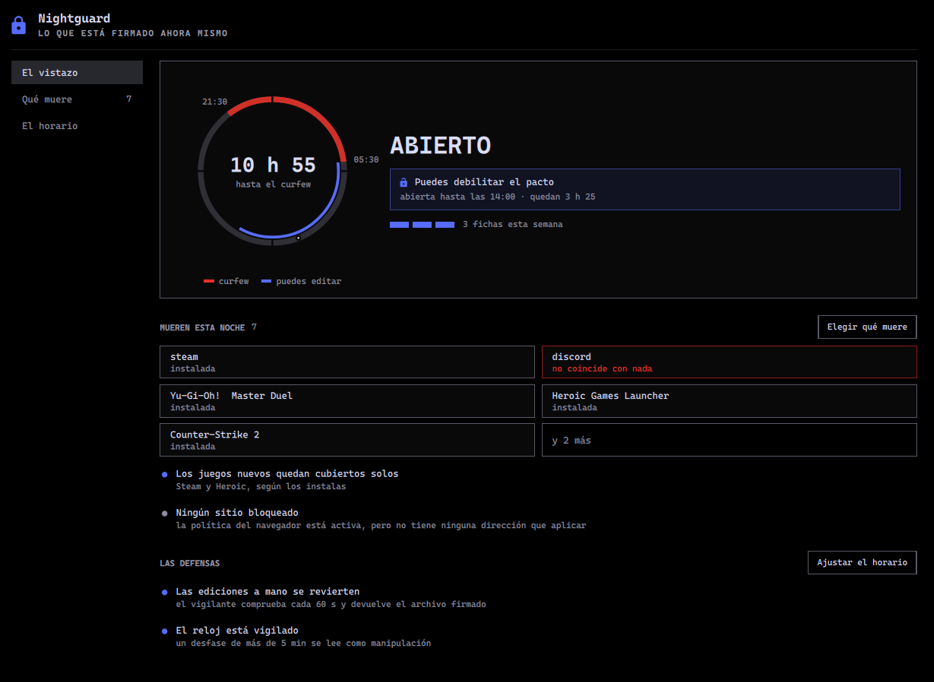

# Nightguard Control


**A curfew you cannot quietly talk yourself out of.**

Nightguard closes your machine at an hour you choose and — this is the part that
makes it different from every blocker with an off switch — makes *weakening* it
cost something. Loosening the rules spends one of three tokens a week, is refused
outside a window you set in the morning, and cannot be done by editing the
config file, because a root watchdog puts hand edits back within a minute.

Your morning self writes the rules. Your two-in-the-morning self has to pay to
change them.



---

## What it actually does

**Closes applications at the hour.** Named by the exact basename of their
executable, which is the only string the enforcer can act on. The picker shows
you both the name you recognise and that string for everything installed, so you
never have to guess it.

**Closes sites, separately.** Web apps — a chat, a calendar, a board — all run
inside one browser process, so ending a process cannot separate them. Their
identity is the address, so they are blocked through a root-owned browser policy
instead.

**Watches the clock.** The system clock is compared against real time. Moving it
forward to skip the night reads as tampering, and tampering closes the house.

**Reverts hand edits.** The signed copy of the config is the truth. The live copy
is yours to edit — and the watchdog will put it back, every minute, because the
whole point is that editing it is not the way to change the rules.

**Prices every change.** Anything that tightens the curfew is free and immediate.
Anything that loosens it spends a token, and there are three a week. Outside the
edit window it is refused before the tokens are even considered — because a
weekly allowance limits how *often* you give in, not *when*, and the hour your
judgement is worst is exactly the hour you reach for it.

## How it is built

Three pieces, and the split between them is the security model:

| | | |
|---|---|---|
| **The signer** | `/usr/local/lib/nightguard`, root-owned | The only thing that writes the config. Classifies every change as tightening or loosening, prices it, signs the result with a key only root can read. Reached through `pkexec`; the password prompt is deliberate friction. |
| **The watchdog** | a root systemd timer | Every 60 seconds: does the live config still match what was signed? If not, put it back. Stopping it asks for an administrator password, every time — no timestamp caching. |
| **The panel** | an [Omarchy](https://omarchy.org) shell plugin, QML | The only sanctioned editor. Shows what is signed, stages what you want to change, tells you what it costs, and hands it to the signer. It never writes anything itself. |

Behind the panel is a small dependency-free Python CLI (`ngtui`) that reads state
and builds proposals. No frameworks anywhere; the YAML the guard reads is parsed
by a hand-written minimal parser, and every edit is a line edit that preserves
your comments and formatting — a re-emitted file would change the bytes the
signature covers.

## Install

```bash
git clone https://github.com/danitrrga/nightguard-control.git
cd nightguard-control
sudo scripts/linux/deploy.sh
```

That is the whole thing. It installs the signer and the watchdog as root, creates
the instance under `/var/lib/nightguard`, seeds a config from
[`config.example.yaml`](config.example.yaml), generates the signing key, signs it,
installs the systemd units, the polkit rule and the sudoers entry, puts the shell
plugin in your Omarchy plugin directory and the application in your launcher.

It binds to one person — the one who gets the panel and the right to sign. It
works that out from `sudo`; say so explicitly if it guesses wrong:

```bash
sudo NIGHTGUARD_OWNER=yourname scripts/linux/deploy.sh
```

Re-run it after `git pull`. It is idempotent, and if it fails part-way it
restarts the watchdog timer before exiting, so it never leaves you unprotected.

Then edit `/var/lib/nightguard/config.yaml` for your hours — the first edit, before
anything is signed into place, is the one you make by hand. Re-run the deploy and
everything after that goes through the panel.

### Requirements

- Linux with [Omarchy 4](https://omarchy.org) (Hyprland + the Quickshell-based shell)
- Python 3.11+, system `python3` — no packages, no virtualenv
- `polkit` and `systemd`
- [`uv`](https://docs.astral.sh/uv/), to install the CLI behind the panel
- A network connection, to verify the real time

The interface is in Spanish. The config file and everything under the hood is in
English.

## Configuring it

Every setting is in [`config.example.yaml`](config.example.yaml), annotated. The
shape that matters most:

```yaml
curfew:
  enabled: true
  start: "23:00"
  end: "07:00"

edit_window:          # when the curfew may be WEAKENED
  enabled: true
  start: "07:00"
  end: "12:00"

blocking:
  native_apps:
    mode: blocklist   # or allowlist — stricter, and it will close your terminal
    blacklist: []     # executable basenames; the panel shows you these
  browser_extension:
    blocked_urls: []  # hosts, closed through the root-owned browser policy
```

Change it from the panel after the first install: click the shield in the bar for
the glance, or open **Nightguard** from the launcher for the full window.

## What it does not protect against

Stated plainly, because a security tool that oversells itself is worse than one
that does not exist:

- **Root can do anything.** This binds a person who has the root password and
  chooses not to use it at midnight. It is a pact, not a prison.
- **Membership of a group that polkit trusts is a total bypass.** On most systems
  that is `wheel`; on Omarchy it can also be `empower`. If you are in a group
  that gets an unprompted yes, every authentication in this model is free. The
  panel warns you when it detects this; it cannot fix it.
- **It does not survive a live USB**, a second account with admin rights, or a
  reinstall. Nothing on the machine can.
- **It cannot separate two web apps in the same browser** except by address, which
  is why sites and applications are two different lists.

## Uninstalling

```bash
sudo systemctl disable --now nightguard-watchdog.timer
sudo rm -f /etc/systemd/system/nightguard-watchdog.{service,timer} \
           /etc/polkit-1/rules.d/00-nightguard.rules \
           /etc/sudoers.d/nightguard
sudo rm -rf /usr/local/lib/nightguard /var/lib/nightguard
rm -rf ~/.config/omarchy/plugins/danitrrga.nightguard
```

Deliberately not a script. Removing the thing that stops you removing it should
take more than one command at two in the morning.

## The retired Windows version

This started as a Tauri/Rust application for Windows, driven by PowerShell hooks.
None of it is built, tested or shipped any more, and it is not in this branch. It
is kept whole on `archive/windows-tauri` if you want to read it.

## License

The [MIT License](LICENSE).
