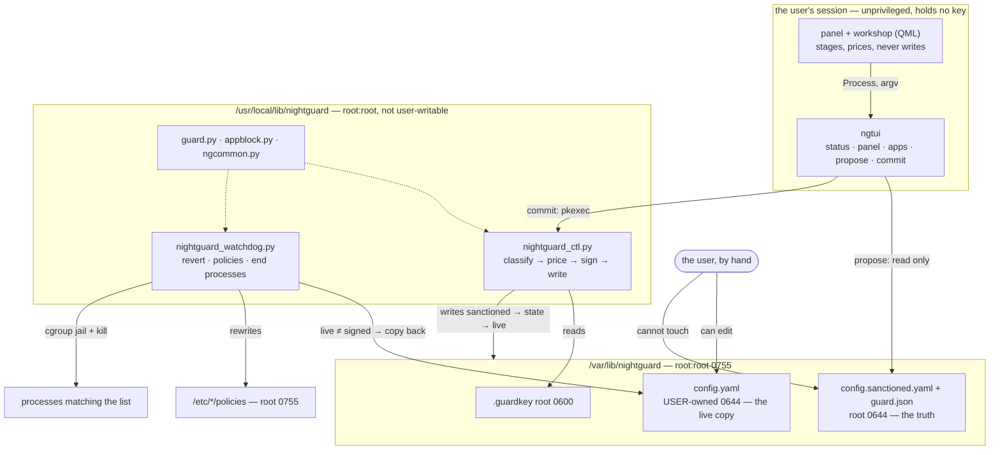

<!-- generated-by: gsd-doc-writer -->
# Architecture

[The README](../README.md) says what Nightguard does. This says how it is put together and
why the pieces sit where they do.

Everything here follows from one requirement: the person the tool binds is the person who
operates the machine and knows the root password. Nothing can be made impossible for him.
What *can* be made true is that every route to a weaker curfew is either priced, refused at
the wrong hour, or undone within a minute — and that none of them is quiet.

## System overview

Nightguard is four processes and one signed pair of files.

The signed pair is `/var/lib/nightguard/config.sanctioned.yaml` (the truth) and
`/var/lib/nightguard/guard.json` (the state: the HMAC of that config, the weekly token
counter, the week anchor, the audit ledger). A third file, `/var/lib/nightguard/config.yaml`,
is the *live* copy that everything else reads — and it is the only file in that directory
the user can write.

- **The signer**, `scripts/linux/nightguard_ctl.py`, deployed to
  `/usr/local/lib/nightguard/nightguard_ctl.py`. Root. The only writer of the signed pair
  and the only reader of the 32-byte key. It classifies a proposed config against the
  sanctioned one, prices it, and writes.
- **The watchdog**, `scripts/linux/nightguard_watchdog.py`, a root systemd timer. Every
  tick: revert the live config if its HMAC no longer matches, rewrite the browser policy
  files, and end the processes the curfew forbids.
- **The CLI**, `ngtui/`, installed as a `uv tool` snapshot in the user's own `~/.local/bin`.
  Unprivileged, key-less, dependency-free. Five subcommands that each print one JSON line.
- **The panel**, `packaging/omarchy/plugins/danitrrga.nightguard/`, a Quickshell plugin in
  the user's session. It reads, stages and prices. It never writes.

`scripts/linux/guard.py` is not a process of its own here — it is the library the other
three import for verified time (`true_unix`, guard.py:88), the curfew verdict
(`curfew_verdict`, guard.py:288) and the revert itself (`verify_and_revert`, guard.py:210).
It also has a `main()` (guard.py:417) that prints the verdict as JSON and exits 0 for allow
/ 1 for deny; that entry point is how an external hook consumes it, and no unit in this repo
invokes it.

## The pieces, and which way trust runs



The arrow that matters is the one that is *missing*: nothing in the session box reaches the
key or the sanctioned pair. The panel's only route to a write is `pkexec` into the signer,
and the signer is the thing that decides whether the write happens at all.

## 1. The trust boundary

### Code: `/usr/local/lib/nightguard`, root-owned

`scripts/linux/deploy.sh:98-104` installs six files there as `root:root 0644` in a `0755`
root-owned directory. The repo is not what runs; this is. The reason is written into the
unit file itself (`scripts/linux/systemd/nightguard-watchdog.service:6-9`): the watchdog
used to `ExecStart` straight out of a working tree in the user's home — a user-writable file
executed as root every sixty seconds, which is arbitrary root code with no password. The
same argument governs the sudoers entry (`scripts/linux/nightguard.sudoers:9-12`): it names
the deployed path, because naming the working tree meant one password bought a signer with
the token check deleted.

### Data: `/var/lib/nightguard`, root-owned — and the directory is the point

`scripts/linux/ngcommon.py:22-26` states the rule the whole layout rests on:

> rename and unlink are governed by the DIRECTORY's mode, not the file's

A `root:root 0600` key inside a *user-owned* directory is not protected. The user cannot
read it, but he can rename it aside and drop in a file of his own — and with a key he chose,
`guard.json` and `config.sanctioned.yaml` can be forged into a self-consistent set that
verifies. That was the real shape of the instance directory before the trust-wall
hardening, and moving it to `/var/lib/nightguard` (`ngcommon.py:27`,
`deploy.sh:121-124`) is what closed it. `deploy.sh:128-137` then re-asserts the modes on
every run: `.guardkey` and `.nightguard.lock` at root `0600`, `guard.json`,
`config.sanctioned.yaml`, `guard-audit.log`, `watchdog.log` at root `0644`.

The lock file's mode is load-bearing too. `guard.app_holds_lock()` (guard.py:154-178) skips
a revert while the signer holds an exclusive `flock` mid-commit. `flock` needs only an open
descriptor, so while the lock file was user-owned, an ordinary `flock -x` froze the revert
indefinitely and silently. It is root `0600` now, and the suppression is bounded anyway:
`LOCK_SUPPRESS_MAX_SECS = 90` (guard.py:148), after which the revert proceeds regardless,
and a suppressed tick is logged as `SUPPRESSED` rather than as `ok`
(`nightguard_watchdog.py:399-402`).

### `config.yaml`: deliberately left user-owned, inside that root-owned directory

`deploy.sh:138-150` chowns the live config back to the owner on every deploy, and the signer
chowns it back after every write (`nightguard_ctl.py:529-543`, applied in `_write_commit` at
line 558). This looks like a hole and is not. Two reasons, both in
`_config_owner`'s docstring (`nightguard_ctl.py:478-507`):

1. **The revert model needs the hand edit to be possible.** The product's claim is that
   editing the config by hand does not work — not that it is blocked, but that it is
   *undone*. A root-owned config.yaml would make the hand edit fail with a permission
   error, which is a different (and weaker, and untestable) promise.
2. **A second consumer nobody would check.** `nightguard_watchdog.py:31-38` derives the
   owner's home from `config.yaml`'s owner:
   `pwd.getpwuid(os.stat(ng.CONFIG).st_uid).pw_dir`. That home is where the Steam and Heroic
   catalogs are read from (`HOME` at watchdog line 38, used at line 351). A root-owned
   config.yaml points the game catalog at `/root`, where there are no games — so game
   blocking silently stops covering anything, with nothing anywhere saying so.

Note the side effect of the root-owned parent, called out at `deploy.sh:139-141`: editors
that save by writing a temp file and renaming it over the original cannot write config.yaml,
because that rename needs write permission on the *directory*. In-place edits work.

The signer reads the intended owner *before* the write and applies it *after*
(`nightguard_ctl.py:530-534`), because `_atomic_write_bytes` replaces the file with a fresh
root-owned one — asking afterwards would only ever answer "root". The owner is resolved from
three sources in order (`nightguard_ctl.py:508-526`): the file's current owner, then
`PKEXEC_UID`, then `SUDO_UID`. `pkexec` sets `PKEXEC_UID` and does **not** set `SUDO_UID`,
so the earlier `SUDO_UID`-only version silently never chowned at all once the panel started
authorising through polkit.

## 2. One change, end to end

Say the user turns on "block games" in the workshop.

**Stage.** `NightguardWriter.stage(key, action, value, label)`
(`NightguardWriter.qml:76-93`) appends `{key, action, value}` to `ops`. Clicking the same
switch again removes the op rather than queueing a second one. Staging never touches disk.

**Price.** Staging calls `refreshPreview()` (`NightguardWriter.qml:131-153`), which runs:

```
ngtui propose --ops-json '[{"key":"blocking.native_apps.block_games","action":"set","value":true}]'
```

`Process` execs the argv directly with no shell, which is why the inline JSON form is safe
(`ngtui/ngtui/__main__.py:425-448`). `_propose` (`__main__.py:451-498`) reads the sanctioned
text, applies the ops through `proposal.apply_ops` → `lineedit`, writes the result to a
`0600` temp file, and prices it with `backend.preview_change`
(`ngtui/ngtui/backend.py:200-221`) — which imports the signer's own `classify_change` and
`quota_decide` rather than reimplementing them. It writes nothing to the instance directory
and returns one JSON line: `{ok, path, dirs, loosening, decision}`.

**Show the cost, then confirm.** `NightguardWriter.canApply`
(`NightguardWriter.qml:60-63`) is false unless the preview arrived, parsed, and came back
`decision.allowed === true`. A polkit dialog must never appear for a change the signer has
already decided to refuse; the reason sits next to the button instead
(`costLine`, `NightguardWriter.qml:282-295`). A preview that *failed* also counts as not
allowed — a commit whose cost could not be computed is a commit whose cost the user was not
told.

**Commit.** `apply()` (`NightguardWriter.qml:189-198`) runs
`ngtui commit --from <the temp file>`. `_commit` (`__main__.py:501-529`) calls
`backend.commit_proposal` (`backend.py:234-277`), which execs:

```
pkexec /usr/bin/python3 /usr/local/lib/nightguard/nightguard_ctl.py commit --from <path>
```

The script path is `CTL_SCRIPT` (`backend.py:54`), derived from a `STACK_DIR` that is
resolved to an absolute real path and pinned: the directory must actually contain
`nightguard_ctl.py` or the import fails closed (`backend.py:37-48`). That value feeds both
`sys.path` and the argv handed to a root program, so a poisoned `NIGHTGUARD_STACK_DIR`
would otherwise redirect both at once. The config travels as a **file**, never as a command
line argument.

`pkexec` hands authentication to Omarchy's own polkit agent, which owns the dialog out of
process, and it caches nothing under `org.freedesktop.policykit.exec` — every commit is a
fresh authentication (`backend.py:241-247`). That is the anti-impulse friction, and it
arrives for free.

**Sign.** `cmd_commit` (`nightguard_ctl.py:563-628`) canonicalizes the proposal (UTF-8, no
BOM, LF, exactly one trailing newline — `canonicalize`, line 74), parses both configs with
the minimal parser, classifies, and asks `quota_decide`. If refused it prints
`REFUSED (...)` to stderr and returns 1, having written nothing. If allowed,
`_write_commit` (line 546) takes the `flock` and writes in this order:

1. `config.sanctioned.yaml` — the revert target, **first**
2. `guard.json` — re-signed: the new config HMAC plus the state HMAC
3. `config.yaml` — the live file, **last**, then chowned back to the user

Any crash converges on old-and-consistent or new-and-consistent, never a forged middle. An
HMAC-chained audit record is appended inside the same lock (line 559).

**Re-read.** On exit code 0 the writer clears the staged ops, emits `committed()`
(`NightguardWriter.qml:248-259`), and the surface reloads from `ngtui panel`.

### The exit code contract

| Code | Source | Means |
|---|---|---|
| 0 | signer | committed, or a no-op (`nightguard_ctl.py:613-615` prints `no-op:` and writes nothing) |
| 1 | signer | refused — out of the edit window, or the weekly quota is spent |
| 2 | signer | could not read the key; refused before deciding anything (`nightguard_ctl.py:565-568`) |
| 126 | `pkexec` | the user dismissed the authentication dialog |
| 127 | `pkexec` | not authorised, or the program could not be run |

The two ranges do not overlap, and that is what lets the panel tell a user who *chose* to
cancel apart from one who was refused (`backend.py:255-258`). `NightguardWriter.report`
(`NightguardWriter.qml:239-278`) gives 126 and 127 two different sentences, and passes the
signer's own `REFUSED`/`committed` lines through verbatim — translating a refusal would put
words in the trust boundary's mouth.

`ngtui commit` itself always exits 0 and returns the signer's code *inside* the JSON
(`__main__.py:502-511`). All five subcommands do this: a non-zero exit from a `Process` is
indistinguishable from a missing binary, so failure is reported as data, never as status.

## 3. The classifier and the price

`FIELD_TABLE` (`nightguard_ctl.py:46-69`) maps each governed field to a comparison kind:
`bool`, `num`, `list_add`, `list_remove`, `mode`, `schedule`, `any`. `_classify_field`
(line 263) turns an old/new pair into `loosen`, `tighten` or `noop`. The polarities are
per-field and deliberate:

- `blocking.native_apps.blacklist` is `list_remove` — taking an app *off* the blacklist
  loosens. `blocking.native_apps.allowlist` is `list_add` — the mirror, because adding to an
  allowlist permits more.
- `blocking.native_apps.mode` is `mode`: allowlist is strictly stricter, so switching *to*
  it tightens and away from it loosens. Anything that is not exactly `allowlist` is treated
  as the permissive value, so a typo cannot classify as a free tightening
  (`nightguard_ctl.py:287-298`).
- `clock_protection.max_offset_minutes` is `num`: a bigger tolerance loosens.

Times are not compared as numbers. `classify_change` (line 304) builds a 1440-slot
minute-of-day mask for the old and new curfew and compares the *sets*
(`_locked_mask` line 138, `_mask_direction` line 153): if any minute that was locked is now
free, that is a loosening, whatever happened to the other end. The edit window uses the same
machinery with its polarity inverted (`_edit_locked_mask`, line 199), because for the edit
window the named hours are the part that is *open*.

The edit window is classified as one unit rather than three fields
(`_classify_edit_window`, line 235), and presence is part of the comparison: deleting the
block entirely is the cheapest imaginable bypass, so it costs the same as disabling it.

`quota_decide` (line 424) then applies, in order:

1. All-noop → allowed, free, writes nothing.
2. Nothing loosens → allowed, free. **Tightening is always free and always immediate, at any
   hour.**
3. It loosens → the clock gate first (`_edit_window_refusal`, line 400). Outside the window,
   refused before the tokens are even consulted. A malformed window is refused too, and so
   is an unverifiable clock — the fail-closed posture, because an unverifiable clock is
   exactly the state an attacker would engineer.
4. Then the quota: allowed if `effective_spent < WEEKLY_TOKENS`, where
   **`WEEKLY_TOKENS = 3`** (`nightguard_ctl.py:42`). Otherwise refused with "available again
   Monday". The week resets lazily by comparing the stored `week_anchor` against the current
   Monday in the config's timezone (lines 334-341, 438-441); ISO dates compare lexically, so
   the comparison is a string comparison on purpose.

One loosening commit costs exactly one token no matter how many fields it touches.

Two things the window deliberately does *not* trust:

- **The window in force is the sanctioned one, never the proposal's.**
  `effective_edit_window` (line 223) ignores `new_doc` entirely. Resolving it from the
  proposal would let a single commit widen the window and then be judged by the widened
  version — the change would authorise itself.
- **The hour is verified time in the signed config's timezone.**
  `verified_now_minutes` (line 344) uses `guard.true_unix()`, not the system clock, and
  reads the zone from the sanctioned config rather than `/etc/localtime` or `$TZ`. It then
  cross-checks the resolved time against the system clock and returns `None` if they
  disagree by more than `clock_protection.max_offset_minutes` — applied whatever
  `clock_protection.enabled` says, because turning that off must not be a way to open the
  edit window. The `.timecache` that `true_unix` reads is user-owned (deploy.sh:151-154), so
  without that cross-check a poisoned cache claiming 10:00 at 02:00 would have bought a
  token-priced loosening at the exact hour the feature exists to refuse.

The preview the user sees is computed by the same two functions, imported
(`backend.py:200-221`), never reimplemented. The difference is only the clock: the preview
uses `cache_only_now_minutes` (`backend.py:150-176`), which stubs out `guard._sntp` and
`guard._http_time` for the duration of the call so a cold cache yields `None` instantly
instead of blocking the UI for ~4 seconds on every keystroke. A warm cache resolves the real
hour, so the preview and the signer agree. The stubs are restored in a `finally`.

The weekly ceiling is likewise sourced, not restated: `backend.WEEKLY_TOKENS` re-exports
`ctl.WEEKLY_TOKENS` (`backend.py:68`), `panel.build` puts it in the payload as
`tokens_total` (`ngtui/ngtui/panel.py:416`), and the QML reads it from there
(`NightguardWorkshop.qml:181`, `NightguardPanel.qml:120`) with a literal `3` only as the
fallback for an unread payload.

## 4. Why edits are line edits

`ngtui/ngtui/lineedit.py:1-20` states the rule:

> HARD RULE — NO YAML EMITTER.

The signature covers the file's **bytes** (`ngcommon.config_hmac` → `hmac_hex(key,
file_bytes(path))`, ngcommon.py:81-88). Re-serialising through a YAML library would reorder
keys, drop comments and change quoting — a different byte string parsing to the same values.
The watchdog would then see the live file's HMAC diverge from the signed one and revert the
user's own commit. The signer's `canonicalize` only normalizes BOM, line endings and the
trailing newline (`nightguard_ctl.py:74-79`); it does not reformat fields, so layout
preservation has to happen upstream.

So `lineedit` edits the addressed line and leaves every other byte identical.
`_find_key_line` (line 44) walks a dotted path by indentation, which is what disambiguates
`blocking.native_apps.enabled` from `blocking.browser_extension.enabled`.
`_rebuild_scalar_line` (line 122) keeps the indent, the key, the inline `# comment`, and the
original quote style. Two list edge cases exist because the config really contains them:
`list_add` (line 203) clears an inline `[]` on the key line first, or the first site ever
blocked writes `blocked_urls: []` followed by an orphan `- youtube.com`, which the parser
cannot read; `list_remove` (line 232) writes `[]` back when it removes the last item, so the
field keeps its type instead of becoming `None`.

Above that, `proposal.py` holds `EDITABLE` (lines 37-71) — a closed set of keys with their
kinds, so a list op on a boolean is refused rather than producing nonsense the signer would
then have to judge. One entry is missing on purpose:
`blocking.browser_extension.extension_id` is editable by nothing, because the signer's
`FIELD_TABLE` has no entry for it — a change would classify as no direction at all, price as
free, and be written anyway. Pointing the managed policy at a different extension is how
site blocking gets switched off entirely (`proposal.py:58-70`).

The parser on the other side is equally deliberate. `ngcommon.yaml_load`
(`ngcommon.py:156-204`) is a hand-written ~50-line reader for one fixed shape: nested maps
by indent, `- ` scalar list items, quoted or bare scalars, no anchors, no aliases, no flow
syntax. It is the *same function* on both sides of the signature — the signer and the guard
import it from the one module, so sign and verify cannot disagree about what a file means.
The whole trust stack is pure stdlib for the same reason stated at `ngcommon.py:1-11`: a
fail-closed discipline tool must never die on a missing import.

## 5. Enforcement

### Applications: the exact basename of `/proc/PID/exe`

`appblock.read_processes` (`appblock.py:473-503`) builds a `Process` from three fields:
`exe` (read via `os.readlink("/proc/PID/exe")`), `cgroup` and `cmdline`. `comm` is
**deliberately absent from the class** (`appblock.py:108-115`), because
`prctl(PR_SET_NAME)` renames a running process to anything its owner likes — proven on this
machine by renaming a python process to `totally-not-ste` while `exe` stayed truthful
(`appblock.py:19-22`). A `(deleted)` suffix is stripped, so copying a binary and deleting
the original does not defeat path matching (`appblock.py:498-501`).

`matches_identity` (`appblock.py:154-184`) is the only identity test, and it is exact:

- An entry starting with `/` matches an exact `exe` or a path **prefix** — that is how
  Proton- and JVM-hosted games are caught, since their `exe` is the loader, not the game.
- A bare entry matches `os.path.basename(proc.exe) == identity` (line 174) and nothing
  else. Never a substring: `portal` would otherwise match `xdg-desktop-portal`, and killing
  that breaks every file picker on the desktop while the webapp the user meant keeps
  running.
- A catalog entry matched by title resolves through its install path prefix (lines 179-184).

`decide_kills` (`appblock.py:217-255`) is pure and takes the world as arguments. Its first
branch is the most important line in the file: **anything other than the verdict `locked`
returns nothing** (line 227). `clock_tamper` and `offline_blocked` are also "not outside
curfew", and treating them as kill-worthy is precisely the bug that retired the first
implementation in June 2026 — a clock jump at three in the afternoon had a root process
SIGKILL Steam and Discord in broad daylight (`appblock.py:1-15`).

A hardcoded floor (`is_floor`, line 135) that config cannot shrink protects the compositor,
the shell, session plumbing, the portals and terminals (`FLOOR_EXES` line 61,
`FLOOR_TERMINAL_EXES` line 98). In allowlist mode the kill set is "everything not named", so
a missing floor entry does not degrade the feature — it takes down the desktop, and with it
the user's only route to the sanctioned editor.

Enforcement itself is a root-owned cgroup jail at `/sys/fs/cgroup/nightguard`
(`appblock.py:414-468`): root creates it *outside* the subtree systemd delegates to the
user, moves the matched PIDs into `cgroup.procs`, and writes `cgroup.kill`. The kernel's
delegation containment rule means the owner cannot migrate a process back out, cannot
unfreeze it, and cannot remove the directory. `cgroup.kill` is also documented as safe
against concurrent forks, which a PID signal loop is not. When no jail can be created (not
root, or no `cgroup.kill`), the watchdog falls back to SIGTERM and logs `WEAK MODE` rather
than letting a silent downgrade read as the strong path having run
(`nightguard_watchdog.py:370-386`).

### Sites: why they cannot be applications

On this machine Discord, the calendar, the todo list and the rest are `--app=` windows of
**one** chromium process (`appblock.py:26-29`). There is no process to end that corresponds
to "Discord" — ending the one that exists takes every other webapp and the allowlist with
it. So a webapp has no executable identity at all; its identity is its address.

That is enforced somewhere else entirely: the root-owned managed browser policy the watchdog
rewrites. The CLI's catalog reflects the same split — `_desktop_entries`
(`__main__.py:109-162`) reads every `.desktop` file and returns `identity: ""` with a `url`
set for anything that resolves to `omarchy-launch-webapp <url>` or a browser
`--app=<url>` (`_webapp_url`, line 165), so the picker routes it to the site list instead of
offering it as an application. Launcher wrappers (`gtk-launch`, `flatpak`, `env`, `sh`)
contribute no identity either (`_LAUNCHER_WRAPPERS`, line 103): their basename is the same
for every program that uses them.

## 6. The watchdog

`nightguard-watchdog.timer` is `OnBootSec=30`, `OnUnitActiveSec=60`, `AccuracySec=15` — one
tick a minute, starting half a minute after boot. The service is `Type=oneshot`, runs as
root with `Environment=NIGHTGUARD_DIR=/var/lib/nightguard`, and `ExecStart`s
`/usr/bin/python3 /usr/local/lib/nightguard/nightguard_watchdog.py` — the deployed copy,
absolutely pathed.

`tick()` (`nightguard_watchdog.py:387-420`) does four things and then writes one line to
`watchdog.log`:

1. **`guard.verify_and_revert(key, state)`** (guard.py:210-241). Recompute the live config's
   HMAC. If it matches the one in `guard.json`, done. If not, and the signer is not holding
   the lock, copy `config.sanctioned.yaml` over `config.yaml` — but only after checking that
   the sanctioned copy's own HMAC still matches the signed state. If it does not, the guard
   writes `HARD_LOCKOUT` (guard.py:36) instead: curfew `00:00`–`23:59`, enabled, offline
   blocking on. Fail closed. The guard **never signs**; re-signing is the signer's job
   alone.
2. **Browser policies.** `desired_bodies` (line 228) computes the whole document each family
   should have right now, and `_missing_policies` (line 249) compares the **entire** file,
   not just the extension id — the blocklist half changes as the curfew opens and closes, so
   an id-only check would leave a stale blocklist all day or an absent one all night.
   Two families, because they read different documents from different places: Chromium-style
   `managed/nightguard.json` under `/etc/chromium`, `/etc/brave`, `/etc/opt/chrome`
   (`POLICY_PATHS`, line 49), and Gecko's single `/etc/<app>/policies/policies.json`, which
   *shadows* the vendor's file in the install directory rather than sitting beside it — so
   the vendor's own document is read and merged in (`MOZILLA_POLICY_TARGETS`, lines 58-70).
   The URL blocklist is applied only while the verdict is `locked`; the extension lock and
   the incognito/guest closures are the always-on floor (`desired_policy`, lines 189-208).
   Incognito and guest mode are disabled because a force-installed extension has no incognito
   access until the user ticks a per-extension box, and no policy exists to tick it — so the
   only available enforcement is removing the loophole.
3. **`_enforce_apps`** (line 316) — the only side-effecting half, kept thin on purpose
   because it is the part that cannot be tested without root. It asks `guard.curfew_verdict`,
   returns immediately unless the verdict is `locked`, asks `appblock.decide_kills`, and
   refuses to act on more than `MAX_KILLS_PER_TICK = 25` matches (line 313) — a safety valve
   that turns an inverted comparison into a loud log line instead of a dead desktop.
4. **Log.** One line per tick, and every suppression, missing key or failed restore appears
   in it.

`verify_browser_lock.py` is the separate proof that the policy files are actually the ones
the browsers read: it starts each Gecko browser headless and reads back which
`policies.json` was used (`deploy.sh:338-341`). A file in a directory the browser ignores is
what the previous setup had.

### The polkit rule

`scripts/linux/polkit/00-nightguard.rules` returns `AUTH_ADMIN` for
`org.freedesktop.systemd1.manage-units` when the unit is `nightguard-watchdog.service` or
`nightguard-watchdog.timer`. Two details are load-bearing:

- **The filename.** Polkit evaluates rules in lexical filename order and the first rule to
  return a value wins. `00-` sorts ahead of the distribution defaults that grant the active
  local session its blanket yes. Without it, `systemctl stop nightguard-watchdog.timer`
  succeeded silently with no prompt — the cheapest bypass of the entire model.
- **`AUTH_ADMIN`, not `AUTH_ADMIN_KEEP`.** No timestamp caching. Every stop re-authenticates.

## 7. The desktop surfaces

The plugin lives in `packaging/omarchy/plugins/danitrrga.nightguard/` and deploys to
`~/.config/omarchy/plugins/danitrrga.nightguard` **as the owner**, not system-wide — a
root-owned file there would be a root-writable path inside the user's session
(`deploy.sh:234-253`). The shell hot-reloads a changed plugin. Every `.qml` in the directory
is copied rather than a hand-kept list: a forgotten file is a plugin that half-loads, and the
only symptom is "is not a type" and a blank widget.

### Plugin dispatch

`manifest.json` declares `"kinds": ["bar-widget", "panel"]` with
`"entryPoints": { "barWidget": "BarWidget.qml", "panel": "NightguardWorkshop.qml" }`. The
shell mounts exactly one loader kind per plugin, so the two surfaces are two entry points of
the same plugin rather than two plugins. That is why the bar widget summons the workshop by
plugin id — `omarchy-shell shell toggle danitrrga.nightguard '{}'`
(`BarWidget.qml:109-114`) — instead of spawning a process of its own, and why the launcher
entry runs exactly the same command (`packaging/omarchy/nightguard.desktop`). `toggle`, not
`summon`, so a second press puts it away instead of opening a second window.

| File | What it is |
|---|---|
| `BarWidget.qml` | The bar icon. Extends `BarWidget` — that is what the bar host instantiates into a slot. Polls `ngtui status --json` and `ngtui panel` on a 30 s timer, 5 s while the dropdown is open. Reads and never writes. |
| `NightguardPanel.qml` | The dropdown. Separate file, loaded by the widget with `Qt.resolvedUrl` and injected with `bar`, `settings` and `anchorItem`. |
| `NightguardWorkshop.qml` | The window — the `panel`-kind entry point. Three views on a rail: `glance`, `apps` ("qué muere"), `schedule`. The open payload may name one (`{"view":"apps"}`); `{}` lands on the glance. |
| `NightguardGlance.qml` | The landing. Shows the **signed** state and nothing staged — if it previewed too, two surfaces would be showing different futures and neither would be the present. |
| `NightguardClock.qml` | Headless. The single reading of the hours: "how long until this changes" and "may the pact be weakened right now". It draws nothing. |
| `DayDial.qml` | The single drawing of the ring: the day as a 24-hour circle, curfew as one arc, the edit window as another, a mark at now. Built with `Shape`/`PathAngleArc`, the way the shell draws its own dial. |
| `NightguardWriter.qml` | The one write path. Both editing surfaces instantiate it. |

The duplication rule behind `NightguardClock` and `DayDial` is the same one behind
`proposal.py`: the first time the two surfaces each computed the hours, they immediately
disagreed — one rounding to hours, one to minutes. A panel and a window disagreeing about
when the curfew begins is worse than either being wrong, because the reader has no way to
tell which to believe.

The bar widget also has to expose `opened`, `open()`, `close()` and `closeForPopoutSwitch()`
(`BarWidget.qml:10-31`). This is a hard requirement of the host, not a convention:
`PopupCard.close()` assigns `open = false` when the owner has no `close()`, destroying the
binding to the widget's own state, and `Bar.findPanelWidget` skips any widget missing those
names.

No QML file may contain a fixed hex colour. Every colour comes from the shell's `Color` and
`Style` singletons so it follows the user's live theme, and `ngtui/tests/test_no_fixed_hex.py`
fails the build on a literal.

### Where the panel's data comes from

All five `ngtui` subcommands print one JSON line and exit 0
(`__main__.py:33-46`). `panel.build` (`ngtui/ngtui/panel.py:397-424`) is pure — verdict,
tokens, the curfew and edit-window views, the blocking lists, live warnings, and the theme
and style tokens the QML paints with. Every failure path collapses to the fixed
`UNAVAILABLE` object (`panel.py:426-451`) rather than a partial one, because a partial panel
reads as a true one.

## 8. Directory map

| Path | What lives there and why |
|---|---|
| `scripts/linux/` | The trust stack, in source form. Nothing here runs — `deploy.sh` installs it to `/usr/local/lib/nightguard`. |
| `scripts/linux/systemd/`, `scripts/linux/polkit/` | The units and the rule, installed to `/etc/systemd/system` and `/etc/polkit-1/rules.d`. |
| `ngtui/ngtui/` | The unprivileged CLI. `backend.py` is the single seam to the trust stack — it imports the live signer rather than vendoring its logic. `panel.py`/`status.py` are pure shaping; `proposal.py`/`lineedit.py` are the edit composer; `catalog.py`/`theme.py` feed the picker and the palette. |
| `ngtui/tests/` | The contract. `cd ngtui && uv run --with pytest python -m pytest -q`. |
| `packaging/omarchy/` | The shell plugin, the `.desktop` entry and the icons. |
| `config.example.yaml` | The annotated schema, and what a first install is seeded from. |

## 9. What this deliberately does not defend against

The README states these plainly; here is where they live in the code.

- **Root can do anything.** Every boundary in this document is a Unix permission or a polkit
  prompt. A user who will type the root password at 02:00 has already won. The design binds
  someone who has the password and chooses not to use it.
- **Membership of a polkit-trusted group is a total bypass.** `wheel` on most systems;
  `empower` on Omarchy, which `run0 --empower` adds you to. After that every polkit action
  returns yes with no prompt — including the `manage-units` action that `00-nightguard.rules`
  raises to `AUTH_ADMIN` specifically so that stopping the watchdog costs an authentication.
  This is **detection only**: `panel.empower_warning` (`ngtui/ngtui/panel.py:455-476`) reads
  the group line and returns "you are in the 'empower' group — the watchdog can be stopped
  without authenticating", `__main__._live_warnings` (`__main__.py:338-356`) looks the group
  up and puts it in the panel payload's `warnings`, and the glance draws it. It says so out
  loud and it cannot fix it.
- **Game auto-detection is a convenience, not a control.** Every source it reads — Steam's
  `appmanifest_*.acf`, Heroic's `installed.json`, `.desktop` files — is a file the user owns
  and can edit at 02:00 (`appblock.py:258-263`). That is why the *launchers* (`steam`,
  `heroic`) belong in the signed blacklist, which lives in the root-owned sanctioned config.
- **A live USB, a second admin account, a reinstall.** Nothing on the machine survives them.
- **Two webapps in the same browser, except by address.** See §5.

One more, worth saying because the code says it: the state is worst-cased when it cannot be
verified. `guard.decide()` (guard.py:345-357) recomputes `state_hmac`, and on a mismatch
rewrites the in-memory state with `weekly_spent = 3` and `grace = None` before doing anything
else. A tampered `guard.json` buys zero tokens, not three.

---

Nothing in this build grants a grace window. `guard.curfew_verdict` honours one if the signed
state carries a `grace` object (guard.py:331-338) and `_sign_state` carries any existing one
forward (`nightguard_ctl.py:472`), but no code path in this repository writes one.
